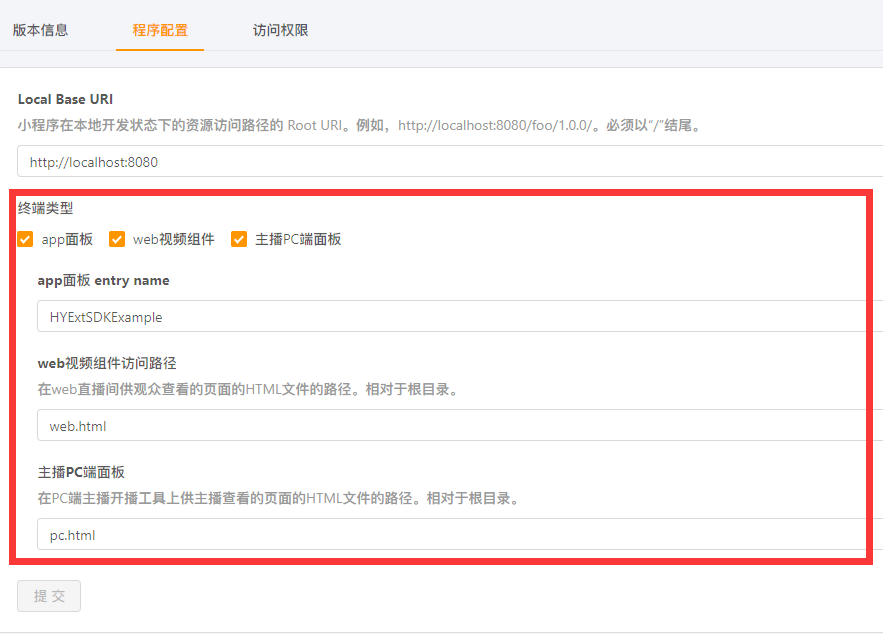

## 虎牙小程序示例代码

### 目录说明

虎牙小程序SDK示例代码存放在`src`目录中，该目录包括两个部分：

* web：使用[开发工具hyext](https://github.com/huya-ext/miniapp/wiki/%E8%84%9A%E6%89%8B%E6%9E%B6)选择**react**作为基础的事例代码。
* app：使用[开发工具hyext](https://github.com/huya-ext/miniapp/wiki/%E8%84%9A%E6%89%8B%E6%9E%B6)选择**react-native**作为基础的事例代码。

### 使用说明

安装[开发工具hyext](https://github.com/huya-ext/miniapp/wiki/%E8%84%9A%E6%89%8B%E6%9E%B6)，执行初始化：

```bash
# web
hyext init demo
# app
hyext init demoRn
```

接下来可以直接进行开发，或者如果想运行虎牙小程序SDK示例代码，把上述web目录里面的文件覆盖到demo里面，把app目录里面的文件覆盖到demoRn里面。运行以下命令进行开发：

```bash
# web
cd demo
hyext run dev
# app
cd demoRn
hyext run dev
```

其中web有两个页面：

* [http://localhost:8080/index.html](http://localhost:8080/web.html)：使用的是虎牙小程序Web端H5 SDK。
* [http://localhost:8080/streamer.html](http://localhost:8080/pc.html)：使用的是虎牙小程序PC端H5 SDK。

web使用虎牙小程序平台提供的线上[开发工具](http://hyext.msstatic.com/hy-ext-comp/1.2.0/dev/index.html)进行开发调试。

app执行完毕之后使用虎牙小程序平台提供的[模拟调试工具](https://github.com/huya-ext/miniapp/wiki/DownloadApp)扫码进入调试界面。

开发调试完成之后，在项目的根目录中执行`hyext release`，分别生成`web`和`app`目录。把这两个目录打到一个`.zip`包里，目录结构如下：

```bash
.
|--web
|--app
```

这里也给出一个[示例](https://github.com/huya-ext/miniapp/blob/master/demo/demo.zip)，可以下载到本地了解正确的代码包的目录结构，也可以直接作为代码包上传到虎牙小程序平台体验虎牙小程序SDK提供的功能。

在[开发者中心](https://ext.huya.com)的程序配置中按如下信息配置：



然后为其中一个小程序上传这个压缩包，配置白名单，就可以提测体验虎牙小程序的基础能力了。

相关流程：

* [快速开始](https://github.com/huya-ext/miniapp/wiki)
* [开发者中心](https://github.com/huya-ext/miniapp/wiki/ems)
* [SDK文档](https://github.com/huya-ext/miniapp/wiki/SDK%E6%96%87%E6%A1%A3)
 