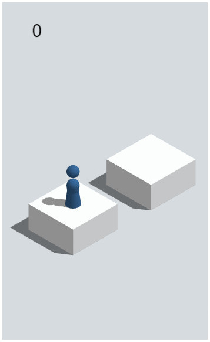
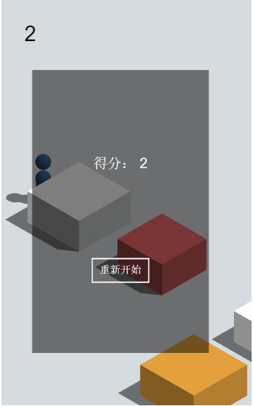

## 虎牙小游戏前端DEMO介绍
### 运行截图


pc端



pc端


手机端

### 文件结构说明
```
.
├── README.md 
├── babel.config.js //H5游戏源码配置
├── dist  //H5游戏构建输出的目录
├── package.json    //H5游戏构建配置+虎牙小程序构建依赖配置
├── project.config.json   //虎牙小程序配置文件
├── public  //H5游戏源码目录
├── src  //H5游戏源码目录
└── vue.config.js  //H5游戏源码配置

```

`dist` 是H5游戏构建输出的目录

### H5游戏构建

1. `node -v` 查看Node.js版本号,要求 `v10.xx.x` 版本.
2. `npm install` 安装Node.js依赖模块.
3. `npm run build` 构建H5游戏,成功后,会在 `dist` 目录下生成:
   
    ```
       ├── favicon.ico
       ├── index.html
       └── js
    ```
### 创建小程序
在[ext.huya.com](https://ext.huya.com/)创建小程序(参考[创建小程序](https://dev.huya.com/docs/#/ems?id=_1-%e5%88%9b%e5%bb%ba%e5%b0%8f%e7%a8%8b%e5%ba%8f)).
`npm install -g  @hyext/cli` 安装小程序cli

### 本地开发
1. `npx  hyext start` 启动本地开发服务.
2. 打开开发者中心([ext.huya.com](https://ext.huya.com/)),按提示手动上传本地`hyext_dist/build-result`目录下的开发配置文件(参考[小程序开发](https://dev.huya.com/docs/#/hyext-cli?id=%e5%bc%80%e5%8f%91)),即可在虎牙app或者pc主播端启动游戏.

### 测试版本
1. 测试版本不依赖本地服务,会以离线包的形式下载及运行游戏,更方便小范围测试体验.
2. `npx  hyext release` 打包.
3. 打开开发者中心([ext.huya.com](https://ext.huya.com/)),按提示把`hyext_release`目录下的压缩包上传(参考[小程序打包](https://dev.huya.com/docs/#/hyext-cli?id=%e6%89%93%e5%8c%85)),即可在虎牙app或者pc主播端以测试版本模式启动游戏.
4. 如果要发给其它用户体验,需要根据虎牙号开通白名单.
   
---

> 联机模式正在开发中,敬请期待...