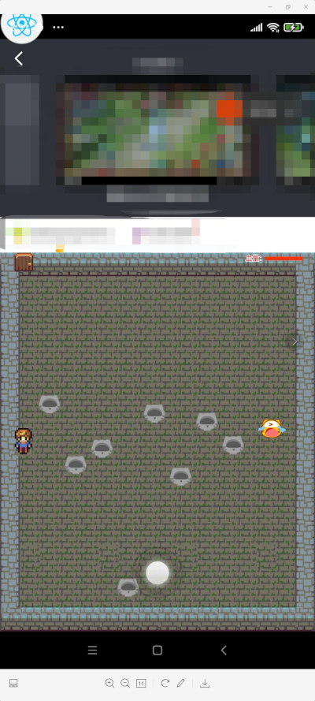

## Pixi.js 小游戏demo

### 版权声明
基于[Pixi实例学习: 宝物猎人](https://github.com/Zainking/learningPixi#casestudy)修改

### 特别说明
此DEMO代码和素材仅供参考,请勿用于正式发布.

### 截图

### 功能点
1.Pixi游戏能力

2.多分辨率适配

3.按钮实现

4.虚拟摇杆实现

5.虎牙小程序API调用

